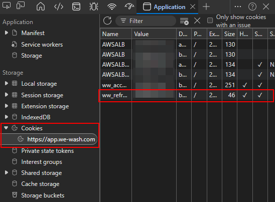

# WeWash for Home Assistant

Integrates [WeWash](https://we-wash.com) laundry room availability into Home Assistant.

> [!IMPORTANT]
> - Using this integration is solely at your own risk and, in theory, could lead to your account being blocked for improper API use.
> - You will most likely be logged out regularly from the WeWash web app. The mobile app, however, does not seem to be affected.

## Installation

In HACS, select "Custom repositories" and add:

- Repository: `https://github.com/bhunecke/wewash-ha`
- Type: `Integration`

Afterwards download the integration via HACS:

## Setup

1. Install via HACS
2. Restart Home Assistant
3. Go to Settings → Devices & Services → Add Integration → WeWash
4. Paste your `ww_refresh` token

## Getting your refresh token

1. Open [app.we-wash.com](https://app.we-wash.com) and log in
2. Press F12 to open the browser DevTools
3. Go to the Application tab (might be hidden in an overflow menu)
4. Expand the "Cookies" item in the list, click on `https://app.we-wash.com`
5. Copy the value of `ww_refresh`

